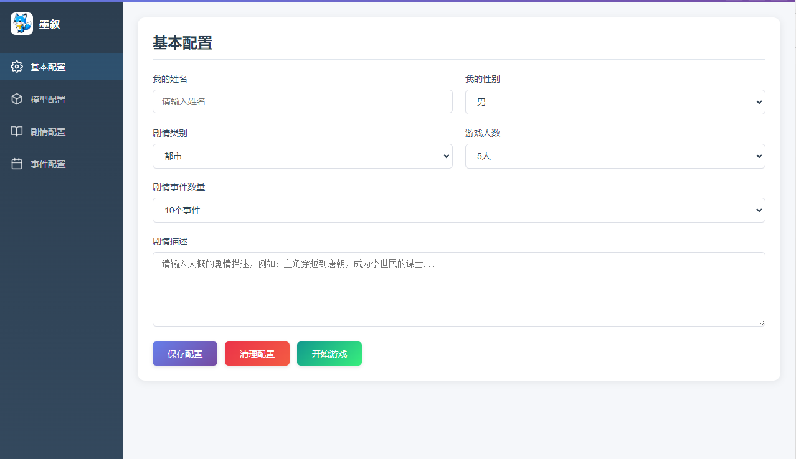
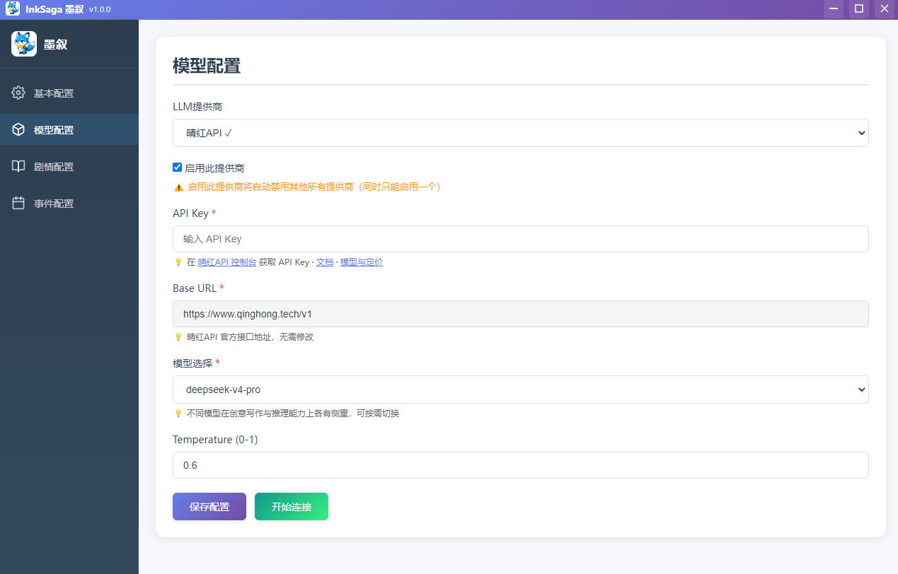

# InkSaga 墨叙 · AI互动小说桌面游戏

> 软件名称：**InkSaga 墨叙**

**InkSaga 墨叙** 是一款 AI 互动小说桌面应用。配置角色与剧情，由大语言模型实时生成故事分支，支持多轮对话与记忆管理。

---

## 预览

| 基本配置 | 模型配置 |
|:---:|:---:|
|  |  |

---

## 功能特性

- **基本配置** — 角色姓名、性别、剧情类别、人数与事件规模
- **模型配置** — 晴红API 一键接入，多模型切换
- **剧情配置** — 场景与世界观设定
- **事件配置** — 事件树与分支管理
- **开始游戏** — AI 实时生成剧情，支持对话记忆与存档

---

## 下载安装（Windows）

| 来源 | 下载 |
|------|------|
| **码云 Release** | [v1.0.0 发布页](https://gitee.com/liudong59/inksaga-ai-interactive-novel-claude-gpt-gemini/releases/tag/v1.0.0) → **InkSaga Setup 1.0.0.exe** |
| **GitHub Release** | [v1.0.0 发布页](https://github.com/liudong317/inksaga-ai-interactive-novel-claude-gpt-gemini/releases/tag/v1.0.0) → **InkSaga Setup 1.0.0.exe** |

Windows x64，双击安装即可。也可从下方克隆源码自行运行。

---

## 快速开始

```bash
git clone https://gitee.com/liudong59/inksaga-ai-interactive-novel-claude-gpt-gemini.git
cd inksaga-ai-interactive-novel-claude-gpt-gemini
npm install
npm start
```

### 使用流程

1. **基本配置** → 填写角色与剧情描述
2. **模型配置** → 选择晴红API，填入 API Key，测试连接
3. **剧情配置 / 事件配置** → 完善场景与事件
4. **开始游戏** → 进入 AI 互动叙事

### 默认模型配置

```yaml
Provider: 晴红API
Base URL: https://www.qinghong.tech/v1
Model:    deepseek-v4-pro
```

| 模型 | 适用场景 |
|------|----------|
| `glm-5.2` | 中文叙事、角色对话 |
| `deepseek-v4-pro` | 复杂剧情推理（默认） |
| `qwen3.7-max` | 长文本、世界观构建 |
| `gpt-5.5` | 通用创意写作 |
| `claude-opus-4-8` | 细腻文风与人物刻画 |

也支持 **自定义 OpenAI 兼容接口** 和 **Ollama 本地模型**。

---

## 获取 API Key（晴红API · OpenAI 兼容）

| | 链接 |
|---|------|
| **注册** | https://www.qinghong.tech/sign-up |
| **API 文档 (Apifox)** | https://qinghongkeji.apifox.cn |
| **模型与定价** | https://www.qinghong.tech/pricing |

---

## 联系作者

微信：`ziyouxiaoqi123`（备注来意：InkSaga咨询 / 定制开发 / 商务合作）

---

## 免责声明

本仓库仅供 **个人学习、创意写作实验与 OpenAI 兼容 API 集成测试** 使用。

- AI 生成内容可能存在偏差，请自行甄别。
- [晴红API](https://www.qinghong.tech) 为独立第三方服务，需自行注册并遵守其条款。
- **使用风险自负**。

---

## 镜像仓库

GitHub 主仓库：https://github.com/liudong317/inksaga-ai-interactive-novel-claude-gpt-gemini

---

## License

MIT — see [LICENSE](LICENSE).
